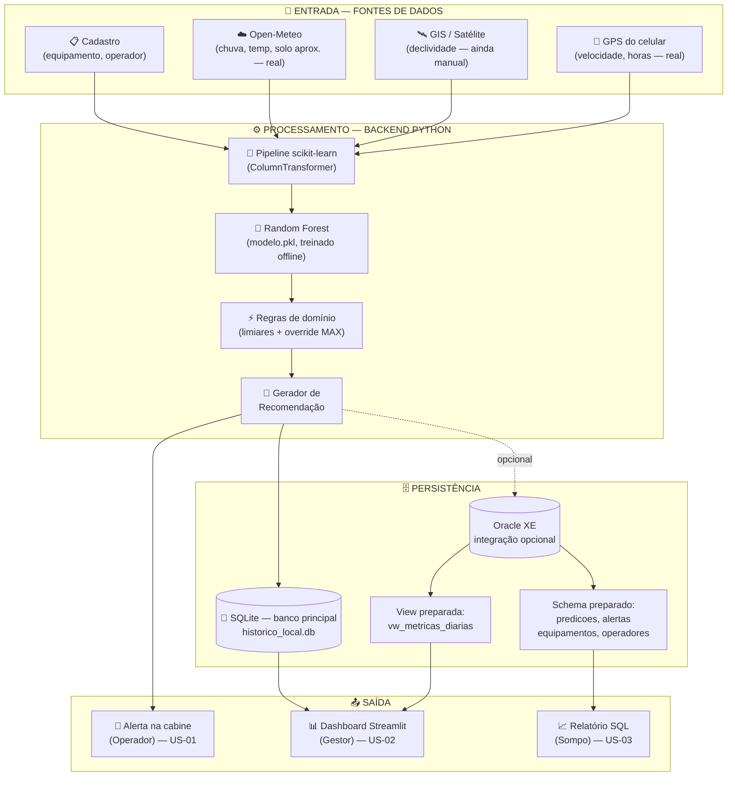
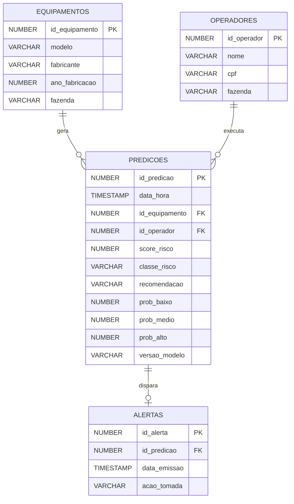

# FIAP - Faculdade de Informática e Administração Paulista

<p align="center">
<a href= "https://www.fiap.com.br/"></a>
</p>

<br>

# Sompo AgroPredict

## 👨‍🎓 Integrantes:
- Renata de Almeida Marinho — RM569342
- Giselli Mayumi Takahashi Yokoyama — RM572690
- David Ribeiro Prado de Lacerda — RM570350
- João Otavio Moraes — RM573227
- Pedro Henrique Lacerda — RM573114

### Responsabilidades

| Integrante | Responsabilidade principal |
|---|---|
| Renata de Almeida Marinho | Requisitos, documentação e validação do fluxo de negócio |
| Giselli Mayumi Takahashi Yokoyama | Engenharia de dados, SQLite e rastreabilidade |
| David Ribeiro Prado de Lacerda | Backend integrador, segurança e versionamento Git |
| João Otavio Moraes | Modelo preditivo, notebook e avaliação das métricas |
| Pedro Henrique Lacerda | Dashboard Streamlit, telemetria e testes funcionais |

## 👩‍🏫 Tutoria

- **Tutora da Turma A:** [Nicolly de Souza](https://github.com/nicollycrs) ([@nicollycrs](https://github.com/nicollycrs))

### Coordenador(a)

- André Godoi Chiovato

---

[](#)
[](#)
[-89.6%25-2C5F2D)](#)
[](#)
[](#)

---

## 📜 Descrição

> **Do reativo ao preditivo: prevenção de riscos operacionais em equipamentos agrícolas.**

O **Sompo AgroPredict** é uma plataforma de monitoramento preventivo de risco operacional para
equipamentos agrícolas. A premissa é simples: **em vez de pagar o sinistro depois, calcular o risco
antes**. O sistema captura variáveis ambientais e operacionais, classifica o risco da operação em
tempo real e devolve ao operador, ao gestor de frota e ao analista da seguradora uma recomendação
acionável antes que o incidente aconteça.

Esta é a **Sprint 3** do Challenge Sompo, cujo foco é a **integração**: os módulos construídos nas
sprints anteriores (banco, fontes de dados e modelo preditivo) passam a funcionar como um fluxo
único e contínuo — **entrada → banco → modelo → saída**.

O caminho de ponta a ponta implementado é:

1. **Entrada** — o GPS do celular do operador fornece posição e velocidade; a partir dessa posição, a
   API **Open-Meteo** fornece temperatura, chuva acumulada em 24h e uma aproximação da umidade do
   solo. As variáveis ainda não automatizáveis (declividade, idade da máquina) entram por slider, e
   qualquer campo automático pode ser assumido manualmente, individualmente, se o sensor
   correspondente não conectar.
2. **Processamento** — os dados alimentam um pipeline `scikit-learn` serializado (`modelo.pkl`) com
   um **Random Forest** treinado na Sprint 2, que devolve classe de risco (BAIXO/MÉDIO/ALTO), score
   de 0 a 100 e as probabilidades de cada classe. Uma camada de regras de domínio aplica *override*
   para ALTO quando qualquer variável cruza um limite crítico absoluto.
3. **Persistência** — cada predição é gravada automaticamente no **SQLite**, banco relacional
   principal do MVP, que funciona localmente e mantém o histórico para auditoria. O repositório
   também inclui schema e scripts de integração com **Oracle XE** como evolução opcional.
4. **Saída** — um **dashboard Streamlit** exibe o resultado com cor por classe, recomendação
   contextual, probabilidades, indicadores por variável, *feature importance* (por que essa decisão)
   e o histórico de predições.

### Evolução em relação à Sprint 2

| Aspecto | Sprint 2 | Sprint 3 |
|---|---|---|
| Origem dos dados | Sliders simulados | **GPS real + API Open-Meteo**, com fallback manual campo a campo |
| Fluxo | Módulos isolados (notebook, SQL, dashboard) | **Fluxo integrado ponta a ponta**, orquestrado pelo backend Python |
| Persistência | Script batch de ingestão no Oracle | **Gravação automática no SQLite** a cada ciclo de telemetria |
| Resiliência | Dependente do Oracle no ar | **SQLite local como banco principal**, sem dependência de serviço externo |
| Horas de operação | Slider manual | **Contador automático** (`HH:MM`) que soma enquanto o GPS está conectado e pausa se o sinal cai |
| Estrutura do repositório | Pastas próprias | **Padrão de template FIAP** (`src`, `document`, `config`, `scripts`, `assets`) |

---

## 📁 Estrutura de pastas

Dentre os arquivos e pastas presentes na raiz do projeto, definem-se:

- <b>.github</b>: arquivos de configuração específicos do GitHub que ajudam a gerenciar e automatizar processos no repositório.

- <b>assets</b>: elementos não-estruturados deste repositório, como imagens — a logo da FIAP, os gráficos gerados pelo notebook (matriz de confusão, *feature importance*, distribuições) e os prints do dashboard.

- <b>config</b>: arquivos de configuração do projeto — `requirements.txt` (dependências) e `.env.example` (modelo das variáveis de ambiente de conexão com o Oracle).

- <b>document</b>: documentos do projeto — `ai_project_document_fiap.md` e `user_stories.md` (as 3 User Stories formalizadas em Dado/Quando/Então). Na subpasta "other", documentos complementares.

- <b>scripts</b>: scripts auxiliares de execução (`run_dashboard.ps1` / `run_dashboard.sh`).

- <b>src</b>: todo o código-fonte criado para o desenvolvimento do projeto.

- <b>README.md</b>: arquivo que serve como guia e explicação geral sobre o projeto (o mesmo que você está lendo agora).

```
somposprint3/
│
├── README.md                          # Este arquivo
├── .gitattributes
├── .gitignore
│
├── .github/
│   └── problem-report.md
│
├── assets/
│   ├── logo-fiap.png
│   ├── 01_distribuicao_classes.png    # Distribuição das classes
│   ├── 02_boxplot_features.png        # Features por classe
│   ├── 03_correlacao.png              # Matriz de correlação
│   ├── 04_operacao_vs_risco.png       # Operação versus risco
│   ├── 05_matriz_confusao.png         # Avaliação do modelo
│   ├── 06_feature_importance.png       # Importância das variáveis
│   ├── 07_dashboard_baixo.png         # Cenário seguro
│   ├── 08_dashboard_alto.png          # Cenário crítico
│   └── 09_dashboard_historico.png     # Persistência SQLite
│
├── config/
│   ├── requirements.txt               # Dependências do projeto
│   └── .env.example                   # Modelo das credenciais do Oracle
│
├── document/
│   ├── ai_project_document_fiap.md    # Documento formal do projeto
│   ├── user_stories.md                # 3 US em Dado/Quando/Então
│   └── other/
│
├── scripts/
│   ├── run_dashboard.ps1              # Sobe o dashboard (Windows)
│   └── run_dashboard.sh               # Sobe o dashboard (Linux/macOS)
│
└── src/
    ├── data/
    │   ├── gerar_dataset_v2.py        # Geração estratificada do dataset de treino
    │   └── dataset_v2.csv             # 1000 linhas, 8 features (simulado)
    │
    ├── modelo/
    │   ├── random_forest.ipynb        # Notebook de treino e avaliação
    │   └── modelo.pkl                 # Pipeline serializado (preproc + RF)
    │
    ├── sql/
    │   ├── schema.sql                 # DDL Oracle XE: 4 tabelas + view + sequences
    │   ├── inserir_predicoes.py       # Ingestão em lote via oracledb
    │   └── consultas.sql              # 6 queries de análise
    │
    └── dashboard/
        ├── app.py                     # Dashboard Streamlit — orquestra o fluxo
        ├── gps.py                     # Captura GPS/velocidade do celular
        ├── clima.py                   # Integração com a API Open-Meteo
        ├── persistencia.py            # Grava no SQLite; integração Oracle opcional
        └── data/
            └── historico_local.db     # Gerado em runtime (não versionado)
```

---

## 🔧 Como executar o código

### Pré-requisitos

| Requisito | Versão | Observação |
|---|---|---|
| Python | 3.10+ | Obrigatório |
| Oracle XE | 21c | **Opcional** — o sistema funciona sem ele |
| Navegador móvel | — | Necessário só para GPS/clima em tempo real |

Todos os comandos abaixo devem ser executados **a partir da raiz do repositório**.

```bash
pip install -r config/requirements.txt
```

O `requirements.txt` é único para todo o projeto e inclui as dependências de telemetria
(`streamlit-js-eval`, `streamlit-autorefresh`, `requests`) além das de ML e banco
(`pandas`, `scikit-learn`, `streamlit`, `oracledb`).

### Passo 1 — Gerar o dataset (simulado, usado só para treinar o modelo)

```bash
cd src/data
python gerar_dataset_v2.py
# Saída: dataset_v2.csv (1000 linhas, distribuição estratificada BAIXO/MEDIO/ALTO)
```

### Passo 2 — Treinar o modelo

```bash
cd src/modelo
jupyter notebook random_forest.ipynb
# Executar todas as células → gera modelo.pkl + 6 gráficos em ../../assets/
```

> O modelo é treinado **uma única vez, offline**, com o dataset simulado acima. A telemetria em
> tempo real (Passo 4) **não retreina** o modelo — ela apenas alimenta o `modelo.pkl` já treinado
> com dados reais em vez de simulados. Ver seção *Limitações conhecidas*.

### Passo 3 — (Opcional) Setup do Oracle XE

```bash
# 1. Conectar no Oracle (usuário e senha definidos na instalação)
sqlplus "usuario"/"senha"@XE
# Deve aparecer o prompt "SQL>"

# 2. Criar o schema (4 tabelas, 1 view, 2 sequences, 6 registros seed)
SQL> @src/sql/schema.sql
SQL> exit

# 3. Inserir predições em lote (PowerShell)
$env:ORACLE_USER="seu_usuario"
$env:ORACLE_PASSWORD="sua_senha"
$env:ORACLE_DSN="localhost:1521/XE"
python src/sql/inserir_predicoes.py --n 100
```

> Use o modelo em `config/.env.example` como referência das variáveis. **Nunca** versione
> credenciais reais — `config/.env` está no `.gitignore`.
>
> Este passo é **opcional**: o dashboard grava normalmente na tabela SQLite local mesmo sem Oracle.

### Passo 4 — Rodar o dashboard

Antes de iniciar, defina as credenciais do login. Elas são obrigatórias e não
devem ser gravadas no repositório:

```powershell
$env:APP_USERNAME="operador"
$env:APP_PASSWORD="use-uma-senha-forte"
```

```bash
# Opção A — via script auxiliar (a partir da raiz)
.\scripts\run_dashboard.ps1        # Windows
bash scripts/run_dashboard.sh      # Linux/macOS

# Opção B — direto
streamlit run src/dashboard/app.py
# Acessar: http://localhost:8501
```

> O **SQLite é o banco principal desta entrega**. A integração Oracle é opcional e somente é ativada
> quando as credenciais e o schema estiverem configurados.
>
> Para usar **GPS e clima em tempo real**, abra o link no **celular do operador** (não no desktop) —
> é o navegador mobile que pede permissão de localização e fornece a velocidade real do chip GPS.
> Sem essa permissão, ou em modo manual, o dashboard funciona igual, só que com sliders.

---

## 🏗 Arquitetura integrada (ponta a ponta)



**Como os dados chegam ao sistema:** a captura acontece no próprio navegador do operador. O
`gps.py` lê a geolocalização (priorizando `coords.speed` do chip GPS e caindo para cálculo por
distância/tempo via Haversine quando indisponível); a posição resultante alimenta o `clima.py`, que
consulta a Open-Meteo. Um ciclo de atualização de **10 segundos** dispara nova leitura, nova
predição e nova gravação.

---

## 🗃 Engenharia de dados

### Banco principal do MVP — SQLite

O banco `src/dashboard/data/historico_local.db` é criado automaticamente e contém:

- `historico_predicoes`: entradas, classe, score, recomendação e origem de cada dado;
- `log_acessos`: login aceito, tentativa negada e logout, com data/hora e usuário;
- chave primária autoincremental e restrição de integridade no campo de sucesso do acesso.

### Modelo complementar preparado — Oracle XE (opcional)



### Decisões de design do schema Oracle opcional

- **Sequences** (`seq_predicao`, `seq_alerta`) para IDs auto-incrementais
- **Indexes** em `predicoes(data_hora)`, `(classe_risco)`, `(id_equipamento)` para as queries do dashboard
- **View `vw_metricas_diarias`** consolidando agregações por dia, alimentando o dashboard sem queries pesadas
- **Coluna `versao_modelo`** em `predicoes` para rastreabilidade (LGPD / auditoria)
- **CHECK constraints** garantindo integridade de domínio (`classe_risco IN ('BAIXO','MEDIO','ALTO')`)

### Persistência do MVP e integração opcional

| Camada | Arquivo | Comportamento |
|---|---|---|
| **SQLite — principal** | `src/dashboard/data/historico_local.db` | Criado em runtime, cresce a cada ciclo de telemetria e sustenta o fluxo funcional demonstrado nesta entrega. |
| **Oracle XE — opcional** | schema em `src/sql/schema.sql` | Schema, consultas e conector estão preparados, mas não são necessários para executar ou avaliar o MVP local. |

### Queries-chave (`src/sql/consultas.sql`)

1. Distribuição geral de risco
2. Top 10 predições mais críticas
3. Score médio por equipamento (visão do gestor)
4. Taxa de aderência dos operadores aos alertas (relatório Sompo)
5. Identificação de fatores de risco predominantes
6. Métricas diárias consolidadas

---

## 📊 Dataset

### Features (8 variáveis)

| Variável | Tipo | Unidade | Fonte em produção | Status |
|---|---|---|---|---|
| `umidade_solo` | Numérica | % | Aproximação via Open-Meteo (camada 0–1cm) | ⚠️ Aproximado — não é satélite dedicado |
| `declividade` | Numérica | % | Mapas GIS / satélite | ⏳ Manual |
| `chuva_24h` | Numérica | mm | Open-Meteo | ✅ Implementado |
| `velocidade` | Numérica | km/h | GPS do celular | ✅ Implementado |
| `status_operacao` | Categórica | — | Input do operador | ✅ Manual por design |
| `temperatura` | Numérica | °C | Open-Meteo | ✅ Implementado |
| `idade_maquina` | Numérica | anos | Cadastro do equipamento | ⏳ Manual |
| `horas_operacao` | Numérica | h | GPS (contador automático, formato `HH:MM`) | ✅ Implementado |

### Justificativa das variáveis adicionadas na Sprint 2

- **`temperatura`** — Calor extremo combinado com jornada longa eleva risco de fadiga do operador e superaquecimento mecânico
- **`idade_maquina`** — Máquinas antigas têm probabilidade maior de falha mecânica, especialmente sob uso intenso
- **`horas_operacao`** — Fadiga do operador e desgaste térmico crescem ao longo do dia

Todas seguem o mesmo princípio: **captáveis por fontes externas à máquina** (celular, cadastro,
API), viabilizando adoção em frotas legadas sem telemetria proprietária.

### Geração estratificada

O dataset **de treino** (usado só para gerar o `modelo.pkl`) é gerado em 3 cenários proporcionais:

| Cenário | Proporção | Distribuições deslocadas |
|---|---|---|
| **Seguro** | 45% | Umidade baixa, declividade baixa, velocidade moderada |
| **Limite** | 35% | Variáveis em zonas de transição |
| **Crítico** | 20% | Múltiplos fatores adversos sobrepostos |

> Importante: esse dataset é **simulado**. Os dados reais capturados via GPS/clima em produção
> alimentam o modelo já treinado, mas ainda não fazem parte do dataset de treino.

---

## 🧠 Modelo preditivo

### Random Forest Classifier — justificativa

| Critério | Por que Random Forest |
|---|---|
| **Interações não-lineares** | Captura naturalmente regras como "umidade alta + chuva = atolamento" |
| **Dataset moderado (1000 linhas)** | Tamanho ideal para RF — pequeno demais para deep learning, grande demais para uma árvore única |
| **Features mistas** | Numéricas + categóricas sem necessidade de normalização |
| **Interpretabilidade** | *Feature importance* nativa → fundamental para seguro e LGPD |

### Hiperparâmetros (grid search manual de 5 combinações)

```python
RandomForestClassifier(
    n_estimators=300,
    min_samples_split=2,
    min_samples_leaf=2,        # leve regularização
    max_features='sqrt',
    class_weight='balanced',   # compensa desbalanceamento
    random_state=42
)
```

### Pipeline completo

```
Entrada (8 features)
    ↓
ColumnTransformer:
    • numéricas (7) → passthrough
    • status_operacao → OneHotEncoder(drop='first')
    ↓
RandomForestClassifier
    ↓
Saída: classe (BAIXO/MÉDIO/ALTO) + score (0–100) + probabilidades
```

Todo o pipeline é serializado em `modelo.pkl` — o dashboard e o script de ingestão SQL apenas fazem
`joblib.load()`.

---

## 🖥 Interface — Dashboard Streamlit

O dashboard (`src/dashboard/app.py`) é a interface funcional que demonstra o ciclo completo:
**entrada → modelo → saída → persistência**.

### Funcionalidades

- **Calculadora de risco em tempo real** — inputs automáticos (GPS + clima) ou sliders manuais para as 8 features, predição instantânea
- **Card de resultado** com cor por classe (🟢 / 🟡 / 🔴), score 0–100 e recomendação contextual
- **Probabilidades** de cada classe com barras de progresso
- **Indicadores por variável** (✅ OK / ⚠️ Alerta / 🔴 MAX) baseados em limiares do domínio
- **Feature importance** do modelo treinado — transparência das decisões
- **Telemetria GPS** — velocidade via GPS do celular (`gps.py`), priorizando `coords.speed` e caindo para Haversine quando indisponível; atualiza a cada **10 segundos**
- **Clima em tempo real** — temperatura, chuva 24h e aproximação de umidade do solo via Open-Meteo (`clima.py`)
- **Contador automático de horas de operação** em formato `HH:MM`, que soma enquanto o GPS está conectado e **pausa** (sem "pular" tempo) quando o sinal cai
- **Overrides manuais por campo** — cada variável automática pode ser assumida manualmente, individualmente, sem desligar a telemetria inteira
- **Persistência automática no SQLite** — banco relacional principal do MVP
- **Persistência manual explícita** — botão para salvar no SQLite o cenário configurado pelos sliders
- **Histórico** em abas: SQLite sempre disponível e Oracle apenas como integração opcional

### Modos de operação

| Modo | Quando | Comportamento |
|---|---|---|
| **Telemetria automática** | Toggle ligado + permissão de localização | Velocidade, clima e horas vêm de GPS/Open-Meteo, atualizando a cada 10s |
| **Manual (geral)** | Toggle desligado | Todas as variáveis via sliders — modo demo/offline |
| **Manual (por campo)** | Checkbox individual na sidebar | Só aquele campo vira slider; os demais continuam automáticos |
| **SQLite (padrão)** | Sempre | Grava e lê o histórico do banco principal do MVP |
| **Oracle (opcional)** | Credenciais e schema configurados | Replica a predição e permite consultar o histórico Oracle |

### Prints

- [`assets/07_dashboard_baixo.png`](assets/07_dashboard_baixo.png) — cenário em condições seguras, classe BAIXO e score 0/100.
- [`assets/08_dashboard_alto.png`](assets/08_dashboard_alto.png) — cenário crítico com override por umidade do solo e score 100/100.
- [`assets/09_dashboard_historico.png`](assets/09_dashboard_historico.png) — histórico auditável de predições persistidas no SQLite local.

---

## 🔒 Segurança da informação

### Controles implementados

| Controle | Onde | Como |
|---|---|---|
| **Controle de acesso** | `src/dashboard/app.py` | Login obrigatório; usuário e senha são lidos de `APP_USERNAME`/`APP_PASSWORD` ou de `.streamlit/secrets.toml`, sem credenciais fixas no código |
| **Log de acesso** | `log_acessos` (SQLite) | Registra login aceito, tentativa negada e logout com data/hora e usuário, sem armazenar a senha |
| **Integridade de domínio** | `src/sql/schema.sql` | `CHECK` constraints garantem que `classe_risco ∈ {BAIXO, MEDIO, ALTO}` e `status_operacao ∈ {Colheita, Deslocamento, Manobra}` — entradas inválidas são rejeitadas pelo banco |
| **Integridade referencial** | `src/sql/schema.sql` | `FOREIGN KEY` ligando `predicoes` a `equipamentos` e `operadores`; impede predições órfãs |
| **Credenciais fora do código** | `src/dashboard/app.py`, `src/sql/inserir_predicoes.py`, `config/.env.example` | Conexão lida de variáveis de ambiente (`ORACLE_USER`, `ORACLE_PASSWORD`, `ORACLE_DSN`); `config/.env` está no `.gitignore` |
| **Rastreabilidade de decisão automatizada** | `predicoes.versao_modelo` + `prob_baixo/medio/alto` | Cada predição registra a versão do modelo e as probabilidades — base para auditoria (LGPD art. 20, direito a revisão de decisão automatizada) |
| **Trilha histórica de decisões** | `historico_predicoes` (SQLite), colunas `fonte_velocidade`, `fonte_clima`, `fonte_horas` | Cada registro guarda **de onde veio cada dado** (GPS, API ou manual) — permite auditar entrada, saída e decisão |
| **Validação de faixas (sanity check)** | `src/data/gerar_dataset_v2.py` (`np.clip`) e sliders limitados | Features restritas a faixas fisicamente plausíveis antes de entrar no modelo |
| **Trilha de auditoria de alertas** | tabela `alertas` (`acao_tomada`, `data_acao`) | Registra se o operador respeitou ou ignorou cada alerta — evidência para análise forense de sinistro |
| **Resiliência de persistência** | `src/dashboard/persistencia.py` | Falha no Oracle não derruba o dashboard nem perde dados — a gravação local sempre acontece |

### Pendências de segurança (assumidas)

Para transparência da avaliação, estes controles ainda são evoluções futuras:

- **Perfis de acesso (RBAC)** — o MVP autentica o usuário, mas ainda possui um único perfil; perfis separados de operador, gestor e analista estão planejados
- **Usuário Oracle com privilégio mínimo** — o código não possui mais credenciais padrão ou usuário `system`; a criação de um usuário de aplicação com *grants* mínimos depende da administração do Oracle
- **Anonimização de dados pessoais** — o campo `cpf` em `operadores` está em texto claro no schema (hoje apenas com dados fictícios de seed)
- **Gravação de `alertas` no fluxo em tempo real** — atualmente só o script batch `inserir_predicoes.py` popula a tabela `alertas`

---

## 📈 Resultados e métricas

### Comparação Baseline × Random Forest

| Modelo | Acurácia (teste) | F1 macro (teste) | Acurácia (CV 5-fold) | F1 macro (CV 5-fold) |
|---|---|---|---|---|
| Logistic Regression (baseline) | 83.2% | 79.3% | — | — |
| **Random Forest (final)** | **89.2%** | **81.7%** | **89.6% (±2.3%)** | **81.4% (±4.8%)** |

> O dataset foi rebalanceado para reforçar a classe MÉDIO (de ~10% para ~14% das amostras), que é a
> mais difícil por ser fronteiriça entre BAIXO e ALTO. Isso elevou o F1 macro do modelo (de 76% para
> 81%), tornando-o mais equilibrado entre as três classes — ao custo de ~1 ponto de acurácia global,
> um *trade-off* favorável.

### Matriz de confusão (teste set, n=250)

```
              Predito
Real      BAIXO  MEDIO  ALTO
BAIXO     [162    9      0]
MEDIO     [  6   23      5]
ALTO      [  0    7     38]
```

**Análise:** após o rebalanceamento, a classe MÉDIO acerta **23 de 34 (recall 68%)** e ALTO mantém
**38/45 (recall 84%)** — crítico no domínio, já que um falso negativo de ALTO significaria deixar
passar uma situação perigosa. Não há confusão entre os extremos (BAIXO↔ALTO = 0 casos): os erros
que restam são entre classes adjacentes.

### Feature importance (top 5)

1. `umidade_solo`
2. `velocidade`
3. `temperatura`
4. `chuva_24h`
5. `declividade`

A justificativa de uma decisão ALTO sempre pode ser explicada apontando a combinação das 2–3
variáveis dominantes (transparência ↔ LGPD).

> Nota: essas métricas foram calculadas sobre o dataset **simulado**. Ainda não há avaliação do
> modelo sobre dados reais capturados via GPS/clima.

---

## 📋 User Stories

Documento completo em [`document/user_stories.md`](document/user_stories.md).

| ID | Persona | Resumo |
|---|---|---|
| **US-01** | Operador de Campo | Alerta preventivo em tempo real com sinalização visual + sonora |
| **US-02** | Gestor de Frota | Dashboard tático com ranking de equipamentos e drilldown |
| **US-03** | Analista Sompo | Relatórios de aderência aos alertas e análise forense de sinistros |

Cada US tem **4 critérios de aceite** no formato Dado/Quando/Então, totalizando **12 critérios**
rastreáveis aos entregáveis técnicos.

---

## ⚠️ Limitações conhecidas

### O modelo não é retreinado com os dados reais (ainda)

O `modelo.pkl` continua sendo o mesmo Random Forest treinado **uma única vez, offline**, com o
dataset simulado `dataset_v2.csv`. Conectar GPS e clima reais mudou **apenas a origem dos inputs em
produção** — os padrões que o modelo reconhece ainda vêm inteiramente da simulação.

A tabela `src/dashboard/data/historico_local.db` é o embrião de um dataset real, mas ainda não tem
**rótulos confirmados** (ex.: sinistros que de fato aconteceram) — sem isso, não é seguro
re-treinar o modelo a partir dela.

### Variáveis que não são capturadas automaticamente

| Variável | Situação atual | Motivo |
|---|---|---|
| `declividade` | Manual (slider) | Depende de mapa GIS/satélite por talhão — fora do escopo do GPS do celular e da API de clima |
| `umidade_solo` | Aproximação via Open-Meteo (camada 0–1cm) | Não é sensor de solo real nem imagem de satélite |
| `idade_maquina` | Manual (slider) | Depende de integração com o cadastro de equipamento |

### Telemetria em tempo real (GPS/clima)

- Geolocalização do navegador exige **HTTPS** em produção (em `localhost` funciona sem certificado)
- `coords.speed` só costuma vir preenchido em **celulares com GPS ativo e em movimento**; parado ou em desktop, cai no cálculo por Haversine, menos preciso
- Atualização a cada **10 segundos** — eventos mais rápidos (ex.: uma freada brusca) não são capturados
- O contador de `horas_operacao` **pausa** se o GPS perde sinal e depende do navegador continuar aberto; fechar a aba não persiste a contagem entre sessões

### Persistência e escopo do dashboard

- O SQLite fica no disco de quem roda o dashboard — sem sincronização central nesta entrega
- O schema e o conector Oracle permanecem como integração opcional, não demonstrada como banco ativo do MVP
- O dashboard exibe a operação **corrente** e o histórico; a segmentação por equipamento/região (US-02) ainda usa IDs fixos e não tem seletor de frota

---

## 🎬 Vídeo de apresentação

🎬 **Link do vídeo (Sprint 3):** *[inserir link do YouTube]*

---

## 🗃 Histórico de lançamentos

* 0.3.0 - 24/08/2026 — **Sprint 3: integração end-to-end**
    * Backend Python orquestrando entrada → banco → modelo → saída
    * Telemetria real: GPS do celular (`gps.py`) e API Open-Meteo (`clima.py`)
    * Persistência automática no SQLite, banco principal do MVP (`persistencia.py`)
    * Schema e conector Oracle mantidos como integração opcional
    * Contador automático de horas de operação e overrides manuais por campo
    * Repositório reorganizado no padrão de template FIAP
* 0.2.0 - Sprint 2 — **Modelo preditivo**
    * Random Forest treinado, validado e exportado (`modelo.pkl`)
    * Dataset ampliado para 8 features e 1000 linhas estratificadas
    * Schema Oracle XE + scripts de ingestão e consultas
    * Dashboard Streamlit funcional
    * 3 User Stories formalizadas em Dado/Quando/Então
* 0.1.0 - Sprint 1 — **Estrutura inicial e proposta documentada**
    * README, dataset simulado inicial, mockups e vídeo de apresentação

---

## 📋 Licença

<p xmlns:cc="http://creativecommons.org/ns#" xmlns:dct="http://purl.org/dc/terms/"><a property="dct:title" rel="cc:attributionURL" href="https://github.com/agodoi/template">MODELO GIT FIAP</a> por <a rel="cc:attributionURL dct:creator" property="cc:attributionName" href="https://fiap.com.br">Fiap</a> está licenciado sobre <a href="http://creativecommons.org/licenses/by/4.0/?ref=chooser-v1" target="_blank" rel="license noopener noreferrer" style="display:inline-block;">Attribution 4.0 International</a>.</p>
